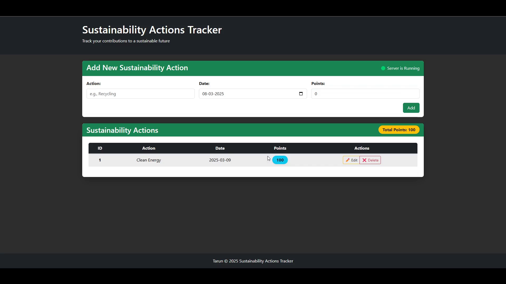

# Sustainability Tracker




# Project Setup
## Cloning the Repository

To get started, clone this repository using the following command:

```sh
git clone https://github.com/Quanta-Naut/sustainability-tracker.git
```

## Backend Server

### Setting Up the Backend Server

Move into the backend directory:

```sh
cd sustainability-tracker/backend
```

Then, install dependencies and run the backend server and migrate:

```sh
pip install -r requirements.txt

python manage.py makemigrations
python manage.py migrate

python manage.py runserver
```

## Frontend Server

### Setting Up the Frontend Server

**Open a new terminal** and navigate to the frontend directory:

```sh
cd sustainability-tracker/frontend
```

Then, install dependencies and run the frontend server:

```sh
npm install
npm start
```

## Contributing

Feel free to contribute by forking the repository and submitting a pull request.

## License

This project is licensed under the [MIT License](LICENSE).